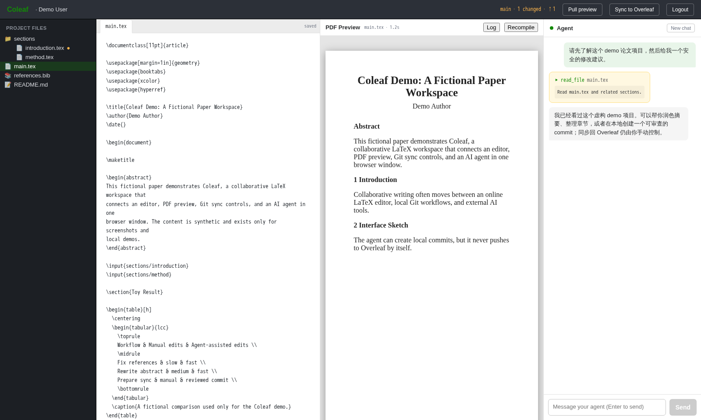

# Coleaf

[English](./README.en.md) | 中文

把任意 Overleaf Git 项目变成一个 **多人协作的 AI LaTeX 写作工作台**。

Coleaf 是一个本地优先的 Web 应用：它连接 Overleaf 的 Git 仓库，在浏览器里提供 Monaco 编辑器、PDF 预览、Git 同步控制，以及一个能读写论文项目文件的 agent 聊天框。每个协作者都可以使用自己的模型凭据和自己的 Overleaf token。



## 为什么做这个？

Overleaf 很适合多人写 LaTeX，coding agent 很适合做结构化修改、润色、补引用、整理章节。但把 agent 直接接进协作论文项目时，通常会遇到几个问题：

- agent 不知道你的完整项目结构。
- 修改散落在多个 `.tex`、`.bib`、`.sty` 文件里，手工复制很烦。
- 多人同时用 agent 改论文时，很难控制谁把什么同步回 Overleaf。
- agent 直接 push 风险太高，需要人类最后确认。

Coleaf 的思路是：**不替代 Overleaf，而是作为 Overleaf Git 旁边的一层 AI workspace**。

## 功能特性

- **连接 Overleaf Git 项目**：每个 session 克隆一份独立 workspace。
- **类 Overleaf 编辑体验**：文件树、Monaco 编辑器、自动保存。
- **PDF 预览**：后端通过 `latexmk` 编译，并在浏览器中预览 PDF。
- **Agent 聊天改论文**：agent 可以列文件、读文件、精确替换、写文件、查看 git 状态、创建本地 commit。
- **人类控制同步**：agent 不会 push，用户点击 `Sync to Overleaf` 后才会 pull/rebase/push。
- **多人协作友好**：通过 git 同步多人改动，冲突会停在 UI 中让用户解决。
- **自带模型凭据**：支持 OpenAI-compatible Responses API endpoint，不需要平台级全局 API key。

## 快速开始

```bash
git clone https://github.com/<your-name>/coleaf.git
cd coleaf
npm install
npm run install:all
npm run dev
```

启动后：

- 前端：`http://localhost:5173`
- 后端：`http://localhost:4000`

## 登录需要什么？

打开页面后需要填写：

| 字段 | 说明 |
| --- | --- |
| Display name | 用作本地 git commit 的作者名 |
| Overleaf Git URL | 形如 `https://git.overleaf.com/<project-id>` |
| Overleaf Git token | 在 Overleaf Account Settings 中创建 |
| Base URL | OpenAI-compatible Responses API endpoint |
| Auth token | 模型服务的 API token |
| Model | 模型名，例如 `gpt-5.5`、`gpt-5`、`gpt-4o` 等 |

> 注意：字段名里仍有少量历史遗留的 `anthropic*` 命名，但当前 agent 调用路径使用的是 OpenAI-compatible Responses API。

## Agent 能做什么？

Agent 目前有 6 个工具，全部限制在当前 session 的 workspace 内：

| Tool | 能力 |
| --- | --- |
| `list_files` | 查看项目文件树 |
| `read_file` | 读取文件内容 |
| `write_file` | 创建或覆盖文件 |
| `edit_file` | 对唯一匹配字符串做精确替换 |
| `git_status` | 查看修改、未跟踪文件和 ahead/behind |
| `git_commit` | stage 所有改动并创建本地 commit |

Agent **不会自动 push**。同步回 Overleaf 必须由用户点击顶部的 `Sync to Overleaf`。

## 同步流程

点击 `Sync to Overleaf` 时，后端会：

1. 把未提交的本地修改 commit。
2. 执行 `git pull --rebase origin` 拉取协作者改动。
3. 如果有本地 commit，执行 `git push origin`。
4. 如果 rebase 冲突，UI 会提示冲突文件，用户手动解决后继续。

## 架构

```text
┌──────────────────── Browser ────────────────────┐
│  React + Monaco + PDF Preview + Chat Panel      │
└────────────────────────┬────────────────────────┘
                         │ HTTP + SSE
┌────────────────────────▼────────────────────────┐
│  Express + TypeScript server                    │
│  ├── /api/sessions        session 管理           │
│  ├── /api/.../files       文件树 / 读取 / 写入    │
│  ├── /api/.../git/*       status / sync / rebase │
│  ├── /api/.../compile     latexmk 编译            │
│  └── /api/.../agent       SSE 流式 agent          │
│       └── OpenAI-compatible Responses API        │
│           + file/git tools                       │
│                                                │
│  Per-session workdir: ./workspaces/<id>/        │
└────────────────────────┬────────────────────────┘
                         │ git pull / push
                         ▼
                  git.overleaf.com
```

## 项目结构

```text
coleaf/
├── server/                 Express + TypeScript 后端
│   └── src/
│       ├── index.ts        HTTP routes
│       ├── sessions.ts     session 持久化和 Overleaf clone
│       ├── files.ts        workspace 内文件操作
│       ├── git.ts          status / commit / sync / conflict
│       ├── compile.ts      latexmk 编译和 PDF 输出
│       └── agent.ts        Responses API 流式 agent loop
├── web/                    Vite + React + Monaco 前端
│   └── src/
│       ├── api.ts          HTTP + SSE client
│       ├── pages/Editor.tsx
│       └── components/
│           ├── FileTree.tsx
│           ├── EditorPane.tsx
│           ├── PdfPane.tsx
│           └── ChatPanel.tsx
├── docs/
│   └── screenshot.png
└── workspaces/             本地 session clone，默认 gitignored
```

## 安全边界

Coleaf 当前是 MVP，更适合本地或可信环境，不建议未经改造直接公网部署。

重要限制：

- `workspaces/<id>/.coleaf-session.json` 会保存 session 信息和凭据，当前是明文。
- workspace 的 git remote 可能包含 Overleaf token。
- 服务端没有内置用户认证。
- agent 可以修改 workspace 内的任意文件。
- LaTeX 编译使用 `latexmk -shell-escape`，不要编译不可信项目。
- 多用户隔离依赖每个 session 的本地目录，不是容器级沙箱。

如果要生产化部署，建议至少补上：

- 用户认证和权限模型。
- session 级容器隔离。
- 凭据加密存储。
- 禁止或隔离 `-shell-escape`。
- agent tool call 审计。
- 更严格的 `.git` 目录保护。

## 开发脚本

```bash
# 安装根目录依赖
npm install

# 安装前后端依赖
npm run install:all

# 同时启动 server 和 web
npm run dev

# 单独启动后端
cd server && npm run dev

# 单独启动前端
cd web && npm run dev

# 构建检查
cd server && npm run build
cd web && npm run build
```

## Roadmap

- Agent 修改前的 diff review 模式。
- 更好的冲突解决 UI。
- 多人 presence 和活动流。
- 评论 / suggestion 模式，而不是直接写文件。
- 每个 session 容器化运行。
- OAuth / SSO / 团队权限。
- 部署模板和 `.env` 配置。

## License

MIT
